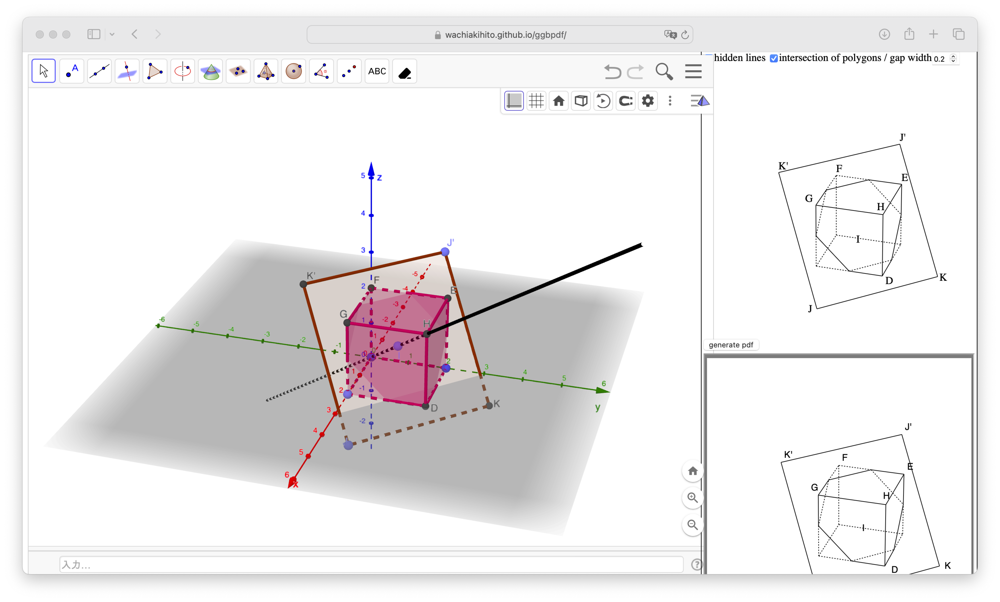
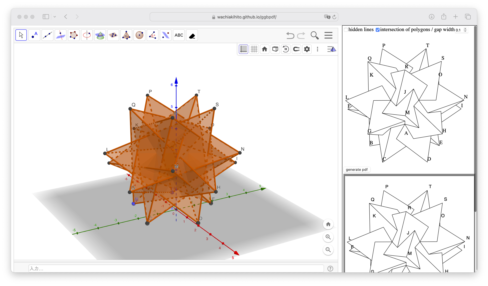

# ggbpdf

動的数学ソフトウェアGeoGebraからpdfファイルを作成します。

* htmlにエクスポート [^1] されたGeoGebraからpdfファイルを作成する**index.html**
* ggbファイルからtexファイルを作成する**ggbtex.rb**

の2つがあります。

[^1]:「htmlにエクスポート」とは、メニューから「...形式でダウンロード」-「Webページとしてのワークシート (.html)」と選択してhtmlファイルを作成することを指しています)。

すべての作図に対応しているわけではなく、
また、空間図形をベクター画像の線画でpdfに出力することを目的としています。
特に、円や放物線など、曲線は出力することができず、
今後も対応することはないと思います。

## index.html

GeoGebraの空間図形の空のファイルを「htmlにエクスポート」した、htmlファイルです

ブラウザで開くだけで動作しますが、動作にはネットワーク接続が必要です。
[https://wachiakihito.github.io/ggbpdf/](https://wachiakihito.github.io/ggbpdf/)
にも置いてあるので、気軽に試せます。

### スクリーンショット



### 使用方法

普段通り空間図形を作図すると、ウィンドウの右側部分にsvgで線画のプレビューが
表示されます。
「generate pdf」ボタンをクリックすると、プレビューの下にpdfが生成されるので、
これを保存するとpdfファイルが得られます。

いくつかあるコントロールには次の効果があります

* hidden lines: 陰線の表示の切り替え
* intersection of polygons: 多角形どうしの交線の表示の切り替え
* gap width: 線分の背後の線に入れる切り欠きの幅

svgとpdfの表示領域は、ブラウザの右端から約400ピクセルで固定しているので、
ブラウザのウィンドウのサイズによっては、GeoGebraと重なってしまいます。
この場合は、ウィンドウを適当にリサイズして重ならないようにして下さい。


### 対応している図形、機能
* 線分
* 多角形
* 角錐
* 角柱
* 正四面体
* 立方体

+ 線分、多角形等の表示・非表示
+ ラベルの表示・非表示
+ ラベルの位置変更

図形のうち、多角形の辺等を含む**線分**と、
多角形や多面体等の**面**を考えて、
面で隠れない線分を描画します。

また、隠れる辺は破線で描画することもでき、
面どうしの交線を描画することもできます。

点は描画しませんが、点のラベルを描画することはできます。
ただし、今のところ描画できるのは点の名前だけで、見出し等には対応していません。

### 対応していない図形、機能
* 線分の太さや破線等のスタイルは、今のところ対応していません。
* 面の交線を他の線分と違うスタイルにすることは、今のところできません。
* 作成されるpdf画像のサイズを変更することはできません。
* すべての曲線は対応する予定がありません。
* 直線、半直線、ベクトルは対応していません。
* 平面は描画できません。
* 軸は描画しません。
* 対称移動や回転移動で作成された図形は、部分的にのみ対応しています。
* プレビューとpdfの表示領域を別ウィンドウにすることはできません。[^2]

[^2]: ただし、グローバルJavascriptの "class GGBPDF" の "TWOWINDOW" をtrueに変更することで実現できます。それを反映するためには、一度htmlにエクスポートして読み込む必要があります)。

### 作図を保存する方法
index.htmlで動作するGeoGebraにおいて、
必要なスクリプトは、すべてグローバルJavascriptに格納されているので、
index.htmlをブラウザで開いて作図してから、
GeoGebraで「htmlにエクスポート」をすると、
pdfファイルを作成する機能を持ったまま保存ができます。

また、代わりに、GeoGebraの通常の「保存」
(「オンライン上に保存」あるいは「このコンピュータに保存」)
をすると通常のggbファイルが得られますが、
これをhtmlにエクスポートしても、pdfファイルを作成する機能を持ったままです。

## 自分でindex.htmlを作る方法
index.htmlは、GeoGebraの空間図形の作図の
グローバルJavascriptに、以下のファイルを単に連結したものを格納し、
htmlにエクスポートしたものです。

1. ggbpdf/ggbpdf.js
2. ggbpdf/lib_hlr3.js
3. ggbpdf/parseggb.js
4. ggbpdf/pdf.js


## ggbtex.rb
ネットワーク接続なしでも使えるため、一応残してありますが、
今後メンテナンスはしない予定です。

usage:
```
$ ruby ggbtex.rb <ggb file>
```
ggbファイルの空間図形のうち、簡単な図形をpicture環境に書き出し、
platexでそのままタイプセットできるtexファイルを標準出力に出力します。

### 実行に必要なファイル
* ggbtex/ggbtex.rb
* ggbtex/parseggb.rb
* ggbtex/lib_hlr.rb

### 対応している図形
概ねindex.htmlに準じますが、
ggbtex.rbはその一部だけに対応します。

## 既知のバグ
index.html、ggbtex.rbとも、
見えているはずの線の一部が陰線となってしまうバグがあります。
原因はそのうち調べる予定です。
