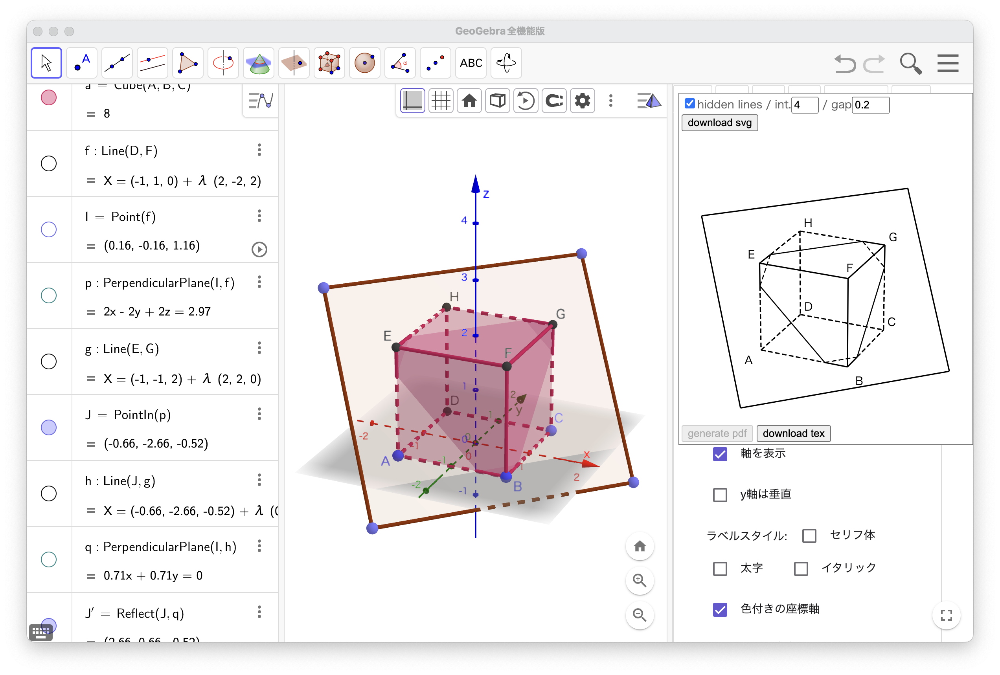
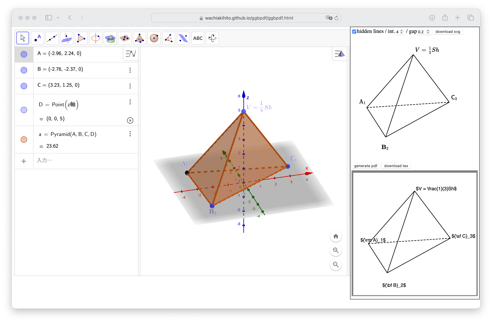
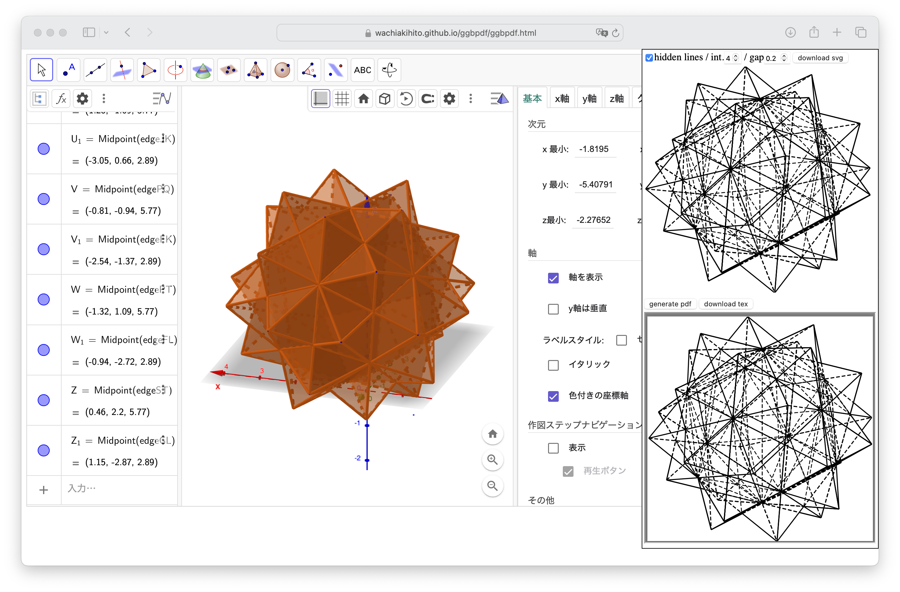

# ggbpdf

- [1. ggbpdf.ggb](#1-ggbpdfggb)
  - [1-1. スクリーンショット](#1-1-スクリーンショット)
  - [1-2. 使用方法](#1-2-使用方法)
  - [1-3. 対応している図形・機能](#1-3-対応している図形機能)
  - [1-4. 対応していない図形・機能](#1-4-対応していない図形機能)
  - [1-5. 保存](#1-5-保存)
  - [1-6. htmlにエクスポート](#1-6-htmlにエクスポート)
- [2. ggbpdf.html](#2-ggbpdfhtml)
  - [2-1. スクリーンショット](#2-1-スクリーンショット)
  - [2-2. 使用方法](#2-2-使用方法)
  - [2-3. 対応している図形・機能、対応していない図形・機能](#2-3-対応している図形機能対応していない図形機能)
  - [2-4. 保存](#2-4-保存)
  - [2-5. htmlにエクスポート](#2-5-htmlにエクスポート)
- [3. ggbtex.rb](#3-ggbtexrb)
  - [3-1. 実行方法](#3-1-実行方法)
  - [3-2. 対応している図形](#3-2-対応している図形)
- [4. 自分で ggbpdf.ggb や ggbpdf.html を作る方法](#4-自分で-ggbpdfggb-や-ggbpdfhtml-を作る方法)
  - [4-1. ggbpdf.html](#4-1-ggbpdfhtml)
  - [4-2. ggbpdf.ggb](#4-2-ggbpdfggb)
  - [4-3. 既存のggbファイルにsvg, pdf画像出力機能を持たせる](#4-3-既存のggbファイルにsvg-pdf画像出力機能を持たせる)
- [5. 既知のバグ](#5-既知のバグ)

動的数学ソフトウェアGeoGebraで作図された簡単な空間図形から、
ベクター画像でsvgやpdfファイルを作成したり、
texのpicture環境を出力したりします。

細かく分けると次の3つがあります。

* **ggbpdf.ggb**: ggbファイル。svg画像と、texのpicture環境を出力できる。
* **ggbpdf.html**: htmlにエクスポート [^1] されたGeoGebra。
svg画像、pdf画像、texのpicture環境を出力できる。
* **ggbtex.rb**: rubyスクリプト。空間図形の作図が保存されたggbファイルからtexファイルを作成する。

[^1]:「htmlにエクスポート」とは、メニューから「...形式でダウンロード」-「Webページとしてのワークシート (.html)」と選択してhtmlファイルを作成することを指しています)。

このうち**ggbpdf.html**は
[https://wachiakihito.github.io/ggbpdf/ggbpdf.html](https://wachiakihito.github.io/ggbpdf/ggbpdf.html)
にも置いてあるので、気軽に試せます。
ブラウザで開くだけで動作しますが、動作にはネットワーク接続が必要です。

また、いずれのプログラムも、すべての作図に対応しているわけではなく、
特に、円や放物線など、曲線は出力することができず、
今後も対応することはないと思います。

## 1. ggbpdf.ggb

このggbファイルをGeoGebraで開くと、svg画像と
texのpicture環境での出力の機能が備わっています。

### 1-1. スクリーンショット



### 1-2. 使用方法

このggbファイルをGeoGebraで開くと、フローティングウィンドウが表示されています。
ここに、空間図形の作図に応じてsvgが表示されます。
このフローティングウィンドウはドラッグで移動できます。

いくつかあるコントロールには次の効果があります

* hidden lines: 見えない線 (陰線) の表示の切り替え
* int.: 多角形どうしの交線の太さ
* gap: 線分の背後の線に入れる切り欠きの幅
* download svg: svg画像のダウンロード
* dowload tex: texのpicture環境のダウンロード

### 1-3. 対応している図形・機能
* 線分
* 多角形
* 角錐 (押し出しも)
* 角柱 (押し出しも)
* 正四面体
* 立方体

+ 点に関する鏡映
+ 線分、多角形等の表示・非表示
+ 線分の太さや破線等のスタイル
+ 点のラベルの表示・非表示（「見出し」も対応。ラベル表示は点のみ対応）
+ 点のラベルの位置変更

* 陰線の表示・非表示の切り替え
* 面の交線の太さの指定。0なら非表示
* 線分の背後の線に入れる切り欠きの幅指定。0なら入れない。

### 1-4. 対応していない図形・機能
* 作成されるsvg画像、pdf画像のサイズは360x360で固定です。
* 点のラベルで表示できるのは名前また見出しです。
見出しにtex数式を用いた場合、picture環境には反映されますが、
svgにはタイプセットされずに表示されます。
* すべての曲線の描画は対応する予定がありません。
* 直線、半直線、ベクトルの描画は対応していません。
* 平面は描画できません。
* 軸は描画しません。
* その他多数

### 1-5. 保存
ggbファイルに保存するときは、通常通りに保存して下さい。

### 1-6. htmlにエクスポート
**ggbpdf.ggb**を「htmlにエクスポート」すると、下の**ggbpdf.html**になります。
svgに加えpdf画像出力も可能になります。
何らかの作図後に「htmlにエクスポート」した場合、その作図も保存されています。


## 2. ggbpdf.html

**ggbpdf.ggb**を「htmlにエクスポート」した、htmlファイルです。
ブラウザで開くとブラウザ上でGeoGebraが動作します。
動作にはネットワーク接続が必要です。
[https://wachiakihito.github.io/ggbpdf/ggbpdf.html](https://wachiakihito.github.io/ggbpdf/ggbpdf.html)
にも置いてあります。

**ggbpdf.html**を開くと、**ggbpdf.ggb**と同様に、フローティングウィンドウが表示されます。
pdf作成が可能なのはネットワーク接続がある場合に限られますが、
その場合は、フローティングウィンドウが縦に2倍になり、
上半分がsvg画像、下半分がpdf画像の領域です

svg画像に対するコントロールは、**ggbpdf.ggb**と同じです。

pdf画像はリアルタイムには表示されず、
「generate pdf」ボタンをクリックすると表示されます。
作成された画像はブラウザの機能を使ってダウンロードして下さい。

### 2-1. スクリーンショット




### 2-2. 使用方法
**ggbpdf.ggb**と同様です。
pdf画像を生成するには、generate pdfボタンをクリックして下さい。
pdf画像を右クリックをするなどして、ブラウザの機能でダウンロードして下さい。

### 2-3. 対応している図形・機能、対応していない図形・機能
**ggbpdf.ggb**と同様ですが、以下の点で異なります。

* 見出しにtex数式を用いた場合、
**ggbpdf.ggb**ではsvg画像にはタイプセットされずに表示されていましたが、
**ggbpdf.html**ではタイプセットされて表示されます。
ただし、「download」ボタンでsvg画像をダウンロードした場合、tex数式は反映されません。
しかし、ブラウザの印刷機能等からpdfを作成すると、
tex数式も含めたベクター画像が得られる可能性があります。
picture環境では、常にtex数式は反映されます。

### 2-4. 保存
ggbファイルに保存すると、**ggbpdf.ggb**の場合と同様、
svg画像、picture環境の出力機能を持ったまま保存できます。
pdf画像出力機能は使えなくなりますが、再び「htmlにエクスポート」すると、使えるようになります。

### 2-5. htmlにエクスポート
「htmlにエクスポート」すると、
svg画像、pdf画像、picture環境出力機能を保ったまま保存ができます。


## 3. ggbtex.rb
texのpicture環境を出力します。
ネットワーク接続なしでも使え、GeoGebraを起動する必要もないため一応残してありますが、
今後メンテナンスはしない予定です。
**ggbpdf.ggb**や**ggbpdf.html**でもpicture環境を出力でき、
対応する図形や機能もそちらの方が多いです。

usage:
```
$ ruby ggbtex.rb <ggb file>
```
ggbファイルの空間図形のうち、簡単な図形をpicture環境に書き出し、
platexでそのままタイプセットできるtexファイルを標準出力に出力します。

### 3-1. 実行方法
**ggbpdf.ggb** や **ggbpdf.html** と異なり、
このスクリプトは本リポジトリのトップレベルではなく、
「ggbtex」フォルダの中にあります。
次の3つのファイルをローカルの同一フォルダに置き、
`$ ruby ggbtex.rb <ggb file>`
で実行して下さい。

* ggbtex/ggbtex.rb
* ggbtex/parseggb.rb
* ggbtex/lib_hlr3.rb

### 3-2. 対応している図形
概ね**ggbpdf.ggb**に準じますが、
**ggbtex.rb**はさらにその一部だけに対応します。


## 4. 自分で ggbpdf.ggb や ggbpdf.html を作る方法

### 4-1. ggbpdf.html
**ggbpdf.html**は**ggbpdf.ggb**を「htmlにエクスポート」すると得られます。
これらは同じグローバルJavascriptで動作していますが、
実行環境を見てpdf出力を可能にするかどうか決めているだけです。

pdf出力するために「pdf-lib」(https://pdf-lib.js.org) を利用していますが、
**ggbpdf.ggb**がpdf出力できない理由は、
GeoGebraからネットワーク上のファイルを読む方法を作者が知らないからです。
もし読めるならば**ggbpdf.ggb**もpdf出力が可能になります。

### 4-2. ggbpdf.ggb
**ggbpdf.ggb**は、空のggbファイルのグローバルJavascriptに
以下のファイルを単に連結したものを格納したものです。

1. ggbpdf2/ggbpdf.js
2. ggbpdf2/lib_hlr.js
3. ggbpdf2/parseggb.js
4. ggbpdf2/pdf.js
5. ggbpdf2/svg.js
6. ggbpdf2/tex.js

### 4-3. 既存のggbファイルにsvg画像、pdf画像、picture環境出力機能を持たせる
既存のggbファイルのグローバルJavascriptに、上記6つのファイルを単に連結したものを格納すれば、
svg, pdf画像出力機能が付加されます。
機能は保存して再度開くと有効になります。
ただし、pdfについては、「htmlにエクスポート」してから使えます。

既にグローバルJavascriptがある場合、上記6ファイルを単に追加で格納して、
**ggbOnInit**()を調整すれば、前からあるグローバルJavascriptと共存できる可能性はありますが、
個別に検証が必要です。

## 5. 既知のバグ
1. **ggbpdf.ggb**、**ggbpdf.html**とも、
図形が増えてくると動作が重くなります。
あまり高速化をしていないせいですが、
当面抜本的な改善はしないと思います。

2. **ggbpdf.html**において、
pdf画像についてはsvg画像と違って、tex数式を用いた点のラベルの表示に対応していません
（**ggbpdf.ggb**においては、svg画像にもtex数式の対応がありません）。
また、**ggbpdf.html**において、svg画像をダウンロードしたときに、tex数式が表示されません。
これらについて、今のところ対応の予定はありません。
原因は、**ggbpdf.ggb**の場合、ネットワーク接続の利用方法を作者が知らないからです。

3. 未対応の図形・ツールが多いですが、
長さが無限の直線については、線分で代用できるので対応していません。
簡単に対応できるものはすべて実装し終えていて、
残る未対応の図形は対応の労力が大きいと思い、
切りのよい現状で、対応図形・ツールの追加は一旦ストップしています。

4. **ggbpdf.ggb**、**ggbpdf.html**、**ggbpdf.rb**とも、
svg画像やpdf画像では360x360の範囲にクリッピングされていますが、
picture環境の出力において、360x360を超える範囲の図形も描画されます。

5. **ggbpdf.ggb**、**ggbpdf.html**、**ggbpdf.rb**とも、
対応していない図形があった場合、
エラーが発生してsvgが更新されないなど異常な動作をするかも知れません。
その場合はundoを用いるなどして、原因の図形を削除すると復帰します。
